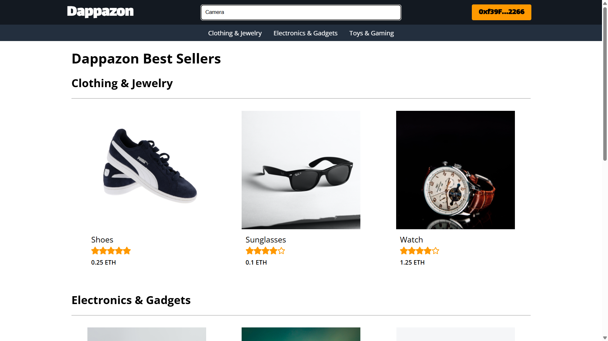

# 🛒 Dappazon – Decentralized Amazon Clone

A **React.js + Hardhat** frontend for a blockchain-based e-commerce marketplace.  
Users can **browse products, view details, and purchase items** directly through Ethereum smart contracts (`Dappazon.sol`).

---

## 🔎 Preview

  

---

## 📦 Prerequisites

Before you begin, make sure you have the following installed:

- 📌 [Node.js](https://nodejs.org/) (v18+ recommended)  
- 📌 npm  
- 🔗 [MetaMask](https://metamask.io/) (or any Ethereum wallet browser extension)  
- 🖥️ Git for cloning the repository  
- ⚡ [Hardhat](https://hardhat.org/) – Ethereum development environment  

👉 You’ll also need the deployed **Dappazon smart contract**.

---

## ⚙️ Setting Up  

 1. **Clone the Repository**

  ```
  git clone https://github.com/FtBunny/Dappazon.git
  cd Dappazon
  ```

2. **Install Dependencies**
  ```
  npm install
  ```

3. **Run Tests (Optional)**
  ```
  npx hardhat test
  ```

4. **Start Hardhat Node**
  ```
  npx hardhat node
  ```

5. **Deploy Contracts**  
  In a separate terminal:
  ```
  npx hardhat run ./scripts/deploy.js --network localhost
  ```

6. **Start Frontend**
  ```
  npm start
  ```
  The app will open at [http://localhost:3000](http://localhost:3000)

  > Make sure your MetaMask is connected to localhost 8545 (Hardhat network).

---

## 🚀 Usage

- 🛍️ **Browse Products** – All products listed in the `Dappazon` contract will display on the homepage  
- 🔍 **Filter by Category** – Clothing, Electronics, Toys  
- 📋 **View Product Details** – Click a product card to view details in a modal popup  
- 💰 **Purchase Items** – Buy directly using ETH (via MetaMask + contract transaction)  

---

